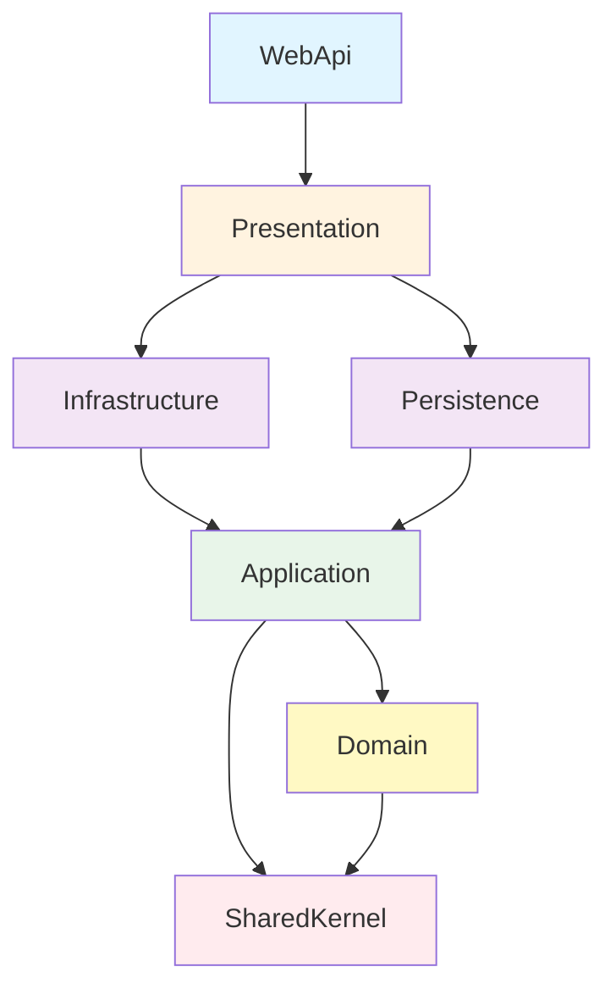

# 🏛️ Clean Architecture Template

[](https://dotnet.microsoft.com/)
[](LICENSE)
[](CONTRIBUTING.md)

> A production-ready .NET 8 template implementing Clean Architecture, Domain-Driven Design (DDD), and Command Query Responsibility Segregation (CQRS) patterns.

## 🚀 Features

- ✨ **Clean Architecture** - Clear separation of concerns with onion architecture
- 🎯 **CQRS Pattern** - Command/Query separation using MediatR
- 🏗️ **Domain-Driven Design** - Rich domain model with proper abstractions
- 🔐 **JWT Authentication** - Secure token-based auth with custom permissions
- 🎭 **Result Pattern** - Functional error handling without exceptions
- 📦 **Minimal APIs** - Modern, lightweight endpoint definitions
- 🧪 **Testing Ready** - Unit test infrastructure with xUnit, FluentAssertions, NSubstitute
- 📊 **Structured Logging** - Serilog with console and file sinks
- 🔄 **Central Package Management** - Consistent dependency versions
- 🎨 **Code Quality** - EditorConfig with enforced coding standards

## 📐 Architecture Overview



### Layer Responsibilities

| Layer | Responsibility | Dependencies |
|-------|---------------|--------------|
| **Domain** | Business entities, rules, and abstractions | SharedKernel only |
| **Application** | Use cases, CQRS handlers, DTOs | Domain, SharedKernel |
| **Infrastructure** | External services, authentication, clients | Application, Domain |
| **Persistence** | Database access, EF Core, repositories | Application, Domain |
| **Presentation** | API endpoints, validators, HTTP concerns | Infrastructure, Application |
| **WebApi** | Composition root, configuration, middleware | All layers |

## 🏗️ Project Structure

```
Back-End/
├── Core/
│   ├── Domain/                    # Business entities and rules
│   │   ├── Entities/             # Domain entities (empty - ready to implement)
│   │   ├── Abstractions/         # Interfaces (IUnitOfWork, IApplicationDbContext)
│   │   ├── Primitives/           # Enumeration base class
│   │   └── Errors/               # Domain-specific errors
│   │
│   └── Application/               # Use cases and CQRS
│       ├── UseCases/             # Feature-organized handlers
│       │   └── Health/Queries/   # Example: Health check
│       ├── Abstractions/         # ICommand, IQuery, ICommandHandler, IQueryHandler
│       ├── Dtos/                 # Data transfer objects
│       └── DI/                   # Dependency injection configuration
│
├── External/
│   ├── Infrastructure/            # External concerns
│   │   ├── Authentication/       # JWT provider, authorization handlers
│   │   ├── Hashers/              # Password hashing (PBKDF2)
│   │   ├── Clients/              # External API clients (ready to implement)
│   │   └── DI/                   # Dependency injection
│   │
│   ├── Persistence/               # Data access
│   │   ├── ApplicationDbContext  # EF Core context
│   │   ├── Configurations/       # Entity configurations (ready to implement)
│   │   ├── Migrations/           # Database migrations
│   │   └── DI/                   # Dependency injection
│   │
│   └── Presentation/              # API layer
│       ├── Endpoints/            # Minimal API endpoints
│       ├── Attributes/           # [HasPermission] attribute
│       └── Extensions/           # HttpContext, Result extensions
│
├── SharedKernel/                  # Cross-cutting primitives
│   ├── Entity.cs                 # Base entity with Guid Id
│   ├── Error.cs                  # Error record
│   └── Result.cs                 # Result<T> for functional error handling
│
├── Tests/
│   └── Application.UnitTests/    # Unit tests (ready to expand)
│
└── WebApi/                        # API host
    ├── Program.cs                # Application entry point
    └── appsettings.json          # Configuration
```

## 🛠️ Tech Stack

### Core Technologies
- **.NET 8** - Latest LTS version
- **C# 12** - Modern language features
- **ASP.NET Core** - Web framework
- **Entity Framework Core 9** - ORM
- **SQL Server** - Database provider

### Key Libraries
- **MediatR** (12.4.1) - CQRS implementation
- **FluentValidation** (11.11.0) - Request validation
- **Serilog** (9.0.0) - Structured logging
- **Swashbuckle** (6.6.2) - OpenAPI/Swagger
- **JWT Bearer** (8.0.13) - Authentication

### Testing
- **xUnit** (2.9.3) - Test framework
- **FluentAssertions** (8.2.0) - Fluent assertions
- **NSubstitute** (5.3.0) - Mocking framework
- **Coverlet** (6.0.4) - Code coverage

## 🚀 Getting Started

### Prerequisites

- [.NET 8 SDK](https://dotnet.microsoft.com/download/dotnet/8.0) or later
- [SQL Server](https://www.microsoft.com/sql-server) (LocalDB, Express, or full)
- IDE: [Visual Studio 2022](https://visualstudio.microsoft.com/) or [Rider](https://www.jetbrains.com/rider/) or [VS Code](https://code.visualstudio.com/)

### Installation

1. **Clone the repository**
   ```bash
   git clone https://github.com/paulo-tribino/CleanArchitectureTemplate.git
   cd CleanArchitectureTemplate/Back-End
   ```

2. **Restore dependencies**
   ```bash
   dotnet restore
   ```

3. **Update connection string**
   
   Edit `WebApi/appsettings.json` or use User Secrets (recommended):
   ```bash
   cd WebApi
   dotnet user-secrets init
   dotnet user-secrets set "ConnectionStrings:DefaultConnection" "Your_Connection_String"
   dotnet user-secrets set "JwtConfigurations:SecretKey" "Your_Secret_Key_Here"
   ```

4. **Create database**
   ```bash
   dotnet ef database update --project Persistence --startup-project WebApi
   ```

5. **Run the application**
   ```bash
   dotnet run --project WebApi
   ```

6. **Open Swagger UI**
   ```
   https://localhost:5001/swagger
   ```

## ⚙️ Configuration

### User Secrets (Development)

Store sensitive data outside source control:

```bash
cd WebApi
dotnet user-secrets set "ConnectionStrings:DefaultConnection" "Server=.;Database=YourDb;..."
dotnet user-secrets set "JwtConfigurations:SecretKey" "YourBase64SecretKey"
dotnet user-secrets set "JwtConfigurations:ExpiresInHours" "1"
```

### Environment Variables (Production)

```bash
export ConnectionStrings__DefaultConnection="Server=...;"
export JwtConfigurations__SecretKey="..."
export JwtConfigurations__Issuer="YourIssuer"
export JwtConfigurations__Audience="YourAudience"
```

### appsettings.json Structure

```json
{
  "ConnectionStrings": {
    "DefaultConnection": "Server=...;"
  },
  "JwtConfigurations": {
    "Issuer": "YourIssuer",
    "Audience": "YourAudience",
    "SecretKey": "Use User Secrets or Env Vars!",
    "ExpiresInHours": 1
  },
  "AllowedOrigins": ["https://yourdomain.com"],
  "Serilog": { }
}
```

## 📝 Usage Examples

### Adding a New Entity

```csharp
// 1. Create entity in Domain/Entities/
public sealed class Product : Entity
{
    private Product(Guid id, string name, decimal price) : base(id)
    {
        Name = name;
        Price = price;
    }

    public string Name { get; private set; }
    public decimal Price { get; private set; }

    public static Product Create(string name, decimal price)
    {
        // Domain validation
        if (string.IsNullOrWhiteSpace(name))
            throw new ArgumentException("Name required", nameof(name));
        
        return new Product(Guid.NewGuid(), name, price);
    }
}

// 2. Add DbSet to IApplicationDbContext
public interface IApplicationDbContext
{
    DbSet<Product> Products { get; }
}

// 3. Create EF Core configuration in Persistence/Configurations/
internal sealed class ProductConfiguration : IEntityTypeConfiguration<Product>
{
    public void Configure(EntityTypeBuilder<Product> builder)
    {
        builder.HasKey(p => p.Id);
        builder.Property(p => p.Name).HasMaxLength(200).IsRequired();
        builder.Property(p => p.Price).HasColumnType("decimal(18,2)");
    }
}

// 4. Create migration
// dotnet ef migrations add AddProduct -p Persistence -s WebApi
```

### Adding a New Use Case (CQRS)

```csharp
// 1. Create Query/Command
public sealed record GetProductByIdQuery(Guid Id) : IQuery<ProductDto>;

// 2. Create Handler
internal sealed class GetProductByIdQueryHandler 
    : IQueryHandler<GetProductByIdQuery, ProductDto>
{
    private readonly IApplicationDbContext _dbContext;

    public GetProductByIdQueryHandler(IApplicationDbContext dbContext)
    {
        _dbContext = dbContext;
    }

    public async Task<Result<ProductDto>> Handle(
        GetProductByIdQuery request,
        CancellationToken cancellationToken)
    {
        if (_dbContext is not DbContext dbContext)
            return Result.Failure<ProductDto>(ProductErrors.DatabaseUnavailable);

        var product = await dbContext.Set<Product>()
            .FirstOrDefaultAsync(p => p.Id == request.Id, cancellationToken);

        if (product is null)
            return Result.Failure<ProductDto>(ProductErrors.NotFound(request.Id));

        var dto = new ProductDto(product.Id, product.Name, product.Price);
        return Result.Success(dto);
    }
}

// 3. Define errors
public static class ProductErrors
{
    public static readonly Error DatabaseUnavailable = 
        new("Product.DatabaseUnavailable", "Cannot connect to database");

    public static Error NotFound(Guid id) => 
        new("Product.NotFound", $"Product with ID {id} not found");
}
```

### Adding a New Endpoint

```csharp
// Presentation/Endpoints/Products/GetProductById.cs
internal sealed class GetProductById : IEndpoint
{
    public void MapEndpoint(IEndpointRouteBuilder app)
    {
        app.MapGet("/api/products/{id:guid}", HandleAsync)
            .WithName("GetProductById")
            .WithTags(Tags.Products)
            .RequireAuthorization()
            .Produces<ProductDto>(StatusCodes.Status200OK)
            .Produces(StatusCodes.Status404NotFound);
    }

    private static async Task<IResult> HandleAsync(
        Guid id,
        ISender sender,
        CancellationToken cancellationToken)
    {
        var query = new GetProductByIdQuery(id);
        var result = await sender.Send(query, cancellationToken);

        return result.IsSuccess
            ? Results.Ok(result.Value)
            : Results.NotFound(new { error = result.Error });
    }
}
```

## 🧪 Testing

### Run All Tests
```bash
dotnet test
```

### Run with Coverage
```bash
dotnet test /p:CollectCoverage=true /p:CoverletOutputFormat=opencover
```

### Writing a Unit Test

```csharp
public class GetProductByIdQueryHandlerTests
{
    [Fact]
    public async Task Handle_WhenProductExists_ShouldReturnSuccess()
    {
        // Arrange
        var dbContext = Substitute.For<IApplicationDbContext>();
        var handler = new GetProductByIdQueryHandler(dbContext);
        var query = new GetProductByIdQuery(Guid.NewGuid());

        // Act
        var result = await handler.Handle(query, CancellationToken.None);

        // Assert
        result.IsSuccess.Should().BeTrue();
        result.Value.Should().NotBeNull();
    }
}
```

## 📚 Best Practices

<details>
<summary><b>🎯 CQRS Guidelines</b></summary>

- **Commands** - Modify state, return `Result` or `Result<T>`
- **Queries** - Read-only, always return `Result<T>`
- Keep handlers focused on single responsibility
- Use `internal sealed` for handlers (auto-discovered by MediatR)
</details>

<details>
<summary><b>🏗️ Domain Modeling</b></summary>

- Rich domain models with behavior, not anemic entities
- Use private constructors + static factory methods
- Keep domain logic in entities, not in handlers
- Use `Error` records for domain-specific errors
</details>

<details>
<summary><b>🔐 Security</b></summary>

- **Never commit secrets** - Use User Secrets or Key Vaults
- Use short-lived JWT tokens (15-60 minutes)
- Implement refresh token rotation
- Configure CORS to specific origins only
- Use `[HasPermission]` attribute for authorization
</details>

<details>
<summary><b>🗂️ Project Organization</b></summary>

- Feature folders in Use Cases: `UseCases/{Feature}/{Commands|Queries}/{Operation}/`
- One endpoint per file: `Endpoints/{Feature}/{Operation}.cs`
- Group related errors: `Errors/{Feature}Errors.cs`
- Keep DTOs simple and immutable (use records)
</details>

## 🗺️ Roadmap

This template is actively being improved. Here's what's planned:

### Coming Soon
- [ ] Domain Events implementation
- [ ] FluentValidation pipeline behavior
- [ ] Value Object base class
- [ ] Aggregate Root pattern
- [ ] Audit fields (CreatedAt, UpdatedAt, etc.)
- [ ] Soft delete support

### Future Enhancements
- [ ] Integration tests project
- [ ] Docker support (Dockerfile, docker-compose)
- [ ] GitHub Actions CI/CD
- [ ] Rate limiting
- [ ] API versioning
- [ ] Health checks endpoint
- [ ] Outbox pattern for transactional messaging
- [ ] Specification pattern

See the [Issues](https://github.com/paulo-tribino/CleanArchitectureTemplate/issues) page for more details and to suggest features.

## 🤝 Contributing

Contributions are welcome! Please follow these steps:

1. Fork the repository
2. Create a feature branch (`git checkout -b feature/amazing-feature`)
3. Commit your changes (`git commit -m 'Add some amazing feature'`)
4. Push to the branch (`git push origin feature/amazing-feature`)
5. Open a Pull Request

Please ensure your code follows the existing code style (see `.editorconfig`).

## 📄 License

This project is licensed under the MIT License - see the [LICENSE](LICENSE) file for details.

## 🙏 Acknowledgments

This template is inspired by:
- [Clean Architecture](https://blog.cleancoder.com/uncle-bob/2012/08/13/the-clean-architecture.html) by Robert C. Martin
- [Domain-Driven Design](https://domainlanguage.com/ddd/) by Eric Evans
- [CQRS Pattern](https://martinfowler.com/bliki/CQRS.html) by Martin Fowler
- [Milan Jovanović's Clean Architecture](https://www.milanjovanovic.tech/)

## 📧 Contact

**Paulo Tribino**  
[](https://www.linkedin.com/in/paulo-tribino/)

For questions or support, please open an issue on GitHub.

---

⭐ If you find this template helpful, please give it a star!
